<div align="center">

# 🤖 AutoTaskAI

**Intelligent task management powered by AI**

*Transform your GitHub activity into actionable Linear tasks automatically*

[](https://opensource.org/licenses/ISC)
[](https://www.typescriptlang.org/)
[](https://vercel.com)
[](https://linear.app)
[](https://openai.com)

[🚀 Quick Start](#-quick-start) •
[📖 Documentation](#-documentation) •
[🤝 Contributing](#-contributing) •
[💬 Community](#-community)

</div>

---

## 🌟 **What is AutoTaskAI?**

AutoTaskAI bridges the gap between development work and project management by automatically analyzing your GitHub repository activity and creating meaningful Linear tasks using advanced AI.

**Stop manually creating tasks for every bug fix, feature, or improvement—let AI do it for you!**

### **The Problem**
- Developers spend valuable time manually creating project management tasks
- Important work gets lost between code changes and task tracking
- Project managers lack visibility into actual development progress
- Context is lost when translating code changes into business tasks

### **The Solution**
AutoTaskAI automatically:
- 🔍 **Analyzes** your commits, PRs, and code changes
- 🧠 **Understands** the context using GPT-4
- 📋 **Creates** relevant Linear tasks with proper priority and labels
- 🔄 **Updates** existing tasks when related work happens
- 🎯 **Assigns** tasks to the right team members

## ✨ **Key Features**

<table>
<tr>
<td width="50%">

### 🔗 **Seamless Integration**
- **GitHub Webhooks** - Real-time event processing
- **Linear API** - Native task management
- **OpenAI GPT-4** - Advanced code understanding
- **Vercel Serverless** - Scalable, zero-maintenance hosting

</td>
<td width="50%">

### 🧠 **Intelligent Analysis**
- **Context-Aware** - Understands your codebase
- **Smart Prioritization** - AI determines urgency levels
- **Auto-Assignment** - Routes tasks to right developers
- **Duplicate Prevention** - Updates existing related tasks

</td>
</tr>
<tr>
<td width="50%">

### 📊 **Rich Task Details**
- **Meaningful Titles** - Clear, actionable task names
- **Detailed Descriptions** - Include relevant code context
- **Proper Labels** - Auto-categorizes by type of work
- **Traceability** - Links back to original GitHub activity

</td>
<td width="50%">

### ⚙️ **Highly Configurable**
- **Custom Rules** - Filter what creates tasks
- **Team Preferences** - Adapt to your workflow
- **Priority Mapping** - Configure urgency levels
- **Label Management** - Automatic categorization

</td>
</tr>
</table>

## 🏗️ **How It Works**

```mermaid
graph LR
    A[📝 GitHub Event] --> B[🔄 Webhook Handler]
    B --> C[🧠 AI Analysis]
    C --> D[📋 Task Generation]
    D --> E[✅ Linear Update]
    
    style A fill:#f9f,stroke:#333,stroke-width:2px
    style C fill:#bbf,stroke:#333,stroke-width:2px
    style E fill:#bfb,stroke:#333,stroke-width:2px
```



### **Workflow Steps**

1. **🔔 Event Trigger** - Developer pushes code or opens PR
2. **📡 Webhook Processing** - AutoTaskAI receives GitHub webhook
3. **🔍 Context Gathering** - Fetches existing Linear tasks for context
4. **🤖 AI Analysis** - GPT-4 analyzes changes and generates suggestions
5. **📋 Task Management** - Creates new tasks or updates existing ones
6. **🔗 Linking** - Maintains traceability between code and tasks

## 🚀 **Quick Start**

> **⚡ Get up and running in 5 minutes!**

### **1. Deploy to Vercel** *(Recommended)*

[](https://vercel.com/new/clone?repository-url=https://github.com/Simple96/AutoTaskAI)

*Or manually:*

```bash
# Clone the repository
git clone https://github.com/Simple96/AutoTaskAI.git
cd AutoTaskAI

# Install dependencies
npm install

# Deploy to Vercel
npx vercel --prod
```

### **2. Configure Environment Variables**

Add these environment variables in your Vercel dashboard or `.env` file:

| Variable | Required | Description | Where to Get |
|----------|----------|-------------|--------------|
| `GITHUB_WEBHOOK_SECRET` | ✅ | Webhook validation secret | [Generate a secure string](https://generate-secret.vercel.app/32) |
| `LINEAR_API_KEY` | ✅ | Linear API access | [Linear Settings → API](https://linear.app/settings/api) |
| `LINEAR_TEAM_ID` | ✅ | Your Linear team UUID | Linear Settings → General |
| `OPENAI_API_KEY` | ✅ | OpenAI API access | [OpenAI API Keys](https://platform.openai.com/api-keys) |
| `OPENAI_MODEL` | ❌ | AI model to use | `gpt-4-turbo-preview` (default) |
| `LOG_LEVEL` | ❌ | Logging verbosity | `info` (default) |

<details>
<summary>📋 <strong>Complete .env template</strong></summary>

```env
# GitHub Configuration
GITHUB_WEBHOOK_SECRET=your_webhook_secret_here
GITHUB_TOKEN=ghp_optional_github_token

# Linear Configuration  
LINEAR_API_KEY=lin_api_your_linear_key_here
LINEAR_TEAM_ID=your_team_uuid_here
LINEAR_DEFAULT_ASSIGNEE_ID=optional_assignee_uuid
LINEAR_DEFAULT_PRIORITY=3
LINEAR_DEFAULT_LABEL_IDS=label1,label2,label3

# OpenAI Configuration
OPENAI_API_KEY=sk-your_openai_key_here
OPENAI_MODEL=gpt-4-turbo-preview

# App Configuration
NODE_ENV=production
LOG_LEVEL=info
```

</details>

### **3. Setup GitHub Webhook**

1. Go to your GitHub repository → **Settings** → **Webhooks**
2. Click **"Add webhook"**
3. Configure:
   - **Payload URL**: `https://your-vercel-url.vercel.app/api/webhook`
   - **Content type**: `application/json`
   - **Secret**: Same as your `GITHUB_WEBHOOK_SECRET`
   - **Events**: Select **"Push"** and **"Pull requests"**
4. Click **"Add webhook"**

### **4. Verify Setup**

Test your deployment:
```bash
# Check health endpoint
curl https://your-vercel-url.vercel.app/api/health

# Expected response: {"status":"healthy",...}
```

## 📖 **Documentation**

### **Local Development**

```bash
# Clone and setup
git clone https://github.com/Simple96/AutoTaskAI.git
cd AutoTaskAI
npm install

# Copy environment template
cp env.example .env
# Edit .env with your API keys

# Start development server
npm run dev

# For webhook testing with ngrok
npx ngrok http 3000
```

## 🔧 **Configuration**

### **Advanced Configuration**

<details>
<summary>🎛️ <strong>Customization Options</strong></summary>

#### **Priority Mapping**
Configure how AI determines task priority:
- `1` = Urgent (critical bugs, security issues)  
- `2` = High (important features, significant bugs)
- `3` = Medium (standard features, improvements) *(default)*
- `4` = Low (nice-to-have, documentation)

#### **Label Management**
AutoTaskAI automatically creates and applies labels:
- `bug` - Bug fixes and error handling
- `feature` - New functionality
- `docs` - Documentation updates  
- `refactor` - Code improvements
- `test` - Testing-related changes

#### **Custom Rules** *(Coming Soon)*
```javascript
// Example: Only create tasks for specific file patterns
rules: {
  include: ["src/**/*.ts", "*.md"],
  exclude: ["**/*.test.ts", "node_modules/**"],
  minCommits: 1,
  requirePRReview: true
}
```

</details>

## 🎯 **Examples**

### **What AutoTaskAI Creates**

| GitHub Activity | Generated Linear Task |
|----------------|----------------------|
| **Bug Fix Commit**<br>`fix: resolve user authentication timeout` | **🐛 Fix user authentication timeout**<br>Priority: High • Assigned: @developer<br>*Auto-generated from commit analysis* |
| **Feature PR**<br>`feat: add dark mode toggle component` | **✨ Implement dark mode toggle**<br>Priority: Medium • Labels: feature, ui<br>*Includes implementation details and testing notes* |  
| **Refactor Changes**<br>`refactor: optimize database queries` | **⚡ Optimize database query performance**<br>Priority: Medium • Labels: refactor, performance<br>*Documents performance improvements made* |

### **Smart Task Management**

- **🔄 Updates existing tasks** when related commits are made
- **🏷️ Auto-applies relevant labels** based on code changes
- **👥 Assigns to commit authors** or configured team members
- **📊 Tracks progress** through linked GitHub activity

## 🎯 **How It Works**

### 1. GitHub Event Processing
- Listens for `push` and `pull_request` events
- Extracts commit messages, file changes, PR descriptions
- Filters relevant information for AI analysis

### 2. AI Analysis
The AI analyzes:
- **Commit messages** for task clues
- **Code changes** for complexity and scope  
- **File patterns** for categorization
- **Existing tasks** to avoid duplicates

AI generates:
- Task titles and descriptions
- Priority levels (1-4)
- Appropriate labels
- Assignee suggestions
- Update vs. create decisions

### 3. Linear Task Management
- **Creates new tasks** for new features/bugs
- **Updates existing tasks** when related changes occur
- **Sets appropriate metadata** (priority, labels, assignee)
- **Links back to GitHub** for traceability

## 📊 **API Reference**

<details>
<summary>🔌 <strong>Webhook Endpoint</strong></summary>

### `POST /api/webhook`
Processes GitHub repository events and creates Linear tasks.

**Request Headers:**
```
X-GitHub-Event: push | pull_request
X-Hub-Signature-256: sha256=<signature>
Content-Type: application/json
```

**Supported Events:**
- `push` - New commits pushed to repository
- `pull_request` - PR opened, closed, or updated

**Response:**
```json
{
  "success": true,
  "message": "Event processed successfully"
}
```

</details>

<details>
<summary>🏥 <strong>Health Check</strong></summary>

### `GET /api/health`
Returns service health status for monitoring.

**Response:**
```json
{
  "status": "healthy",
  "services": {
    "llm": "healthy",
    "linear": "healthy"
  },
  "timestamp": "2024-01-01T00:00:00.000Z",
  "version": "1.0.0"
}
```

**Status Values:**
- `healthy` - All services operational
- `degraded` - Some services have issues  
- `error` - Critical service failures

</details>

## 🛠️ **Development**

### **Project Structure**

```
AutoTaskAI/
├── api/                 # Vercel serverless functions  
│   ├── webhook.ts      # GitHub webhook handler
│   └── health.ts       # Health check endpoint
├── src/
│   ├── services/       # Core business logic
│   │   ├── github.ts   # GitHub integration  
│   │   ├── llm.ts      # AI analysis service
│   │   ├── linear.ts   # Linear API client
│   │   └── orchestrator.ts # Main workflow coordinator
│   ├── types/          # TypeScript type definitions
│   └── utils/          # Shared utilities
└── docs/               # Additional documentation
```

### **Development Workflow**

```bash
# Setup development environment
git clone https://github.com/Simple96/AutoTaskAI.git
cd AutoTaskAI
npm install
cp env.example .env
# Configure your .env file

# Start development server
npm run dev              # Builds and starts server
npm run dev:watch        # Auto-restart on changes

# Code quality
npm run type-check       # TypeScript validation
npm run build           # Production build
npm run lint            # Code linting

# Testing webhooks locally
npx ngrok http 3000     # Expose local server
# Use ngrok URL in GitHub webhook settings
```

### **Architecture Decisions**

- **Serverless Functions** - Zero maintenance, automatic scaling
- **TypeScript** - Type safety and better developer experience  
- **Structured Logging** - JSON logs with request tracing
- **Modular Services** - Clean separation of concerns
- **Error Handling** - Comprehensive error tracking and recovery

## 🎨 **Customization**

<details>
<summary>🔧 <strong>Customization Guide</strong></summary>

### **AI Behavior** (`src/services/llm.ts`)
```typescript
// Modify system prompts for different analysis styles
private getSystemPrompt(): string {
  return `You are a ${this.customRole} that analyzes...`;
}

// Adjust confidence thresholds
const MIN_CONFIDENCE = 0.7; // Only create high-confidence tasks
```

### **Task Templates** (`src/services/linear.ts`)
```typescript
// Customize task descriptions
private enrichTaskDescription(suggestion: LLMTaskSuggestion): string {
  return `
## 🎯 Objective
${suggestion.task.description}

## 📋 Acceptance Criteria
- [ ] Implementation complete
- [ ] Tests added
- [ ] Documentation updated

## 🔗 Related
- Repository: ${repositoryName}
- Confidence: ${suggestion.confidence}
  `;
}
```

### **Event Filtering** (`src/services/orchestrator.ts`)
```typescript
// Custom filtering logic
private shouldProcessEvent(payload: GitHubWebhookPayload): boolean {
  // Skip dependabot PRs
  if (payload.sender.login === 'dependabot[bot]') return false;
  
  // Only process main branch
  if (payload.pull_request?.base.ref !== 'main') return false;
  
  return true;
}
```

</details>

## 🔍 **Monitoring & Analytics**

### **Structured Logging**
AutoTaskAI provides comprehensive logging for monitoring:

```json
{
  "timestamp": "2024-01-01T12:00:00.000Z",
  "level": "INFO", 
  "service": "TaskOrchestrator",
  "message": "Task created successfully",
  "context": {
    "action": "task_created",
    "repository": "user/repo", 
    "taskId": "abc-123",
    "requestId": "req_1234567890_abc123"
  }
}
```

### **Monitoring Endpoints**
- **Health Check**: `/api/health` - Service status monitoring
- **Webhook Status**: Monitor GitHub webhook delivery in repo settings
- **Usage Tracking**: OpenAI token usage in API logs

### **Key Metrics to Track**
- **Task Creation Rate** - Tasks created per repository/day
- **Processing Time** - End-to-end webhook processing duration  
- **AI Confidence** - Average confidence scores for task suggestions
- **Error Rates** - Failed webhook processing attempts
- **Token Usage** - OpenAI API costs and consumption

## 🤝 **Contributing**

We love contributions! AutoTaskAI is open source and welcomes improvements from the community.

### **Getting Started**

1. **🍴 Fork the repository**
2. **🌿 Create a feature branch**: `git checkout -b feature/amazing-feature`
3. **💻 Make your changes** with proper tests and documentation
4. **✅ Run the test suite**: `npm run type-check && npm run lint`
5. **📝 Commit your changes**: Use [conventional commits](https://conventionalcommits.org/)
6. **🚀 Push to your branch**: `git push origin feature/amazing-feature`
7. **🎯 Open a Pull Request** with a clear description

### **Development Guidelines**

- **Code Style**: Follow existing TypeScript patterns
- **Testing**: Add tests for new functionality  
- **Documentation**: Update README and inline docs
- **Logging**: Use structured logging with proper context
- **Types**: Maintain strict TypeScript typing

### **Areas for Contribution**

- 🐛 **Bug fixes** - Help improve stability
- ✨ **New features** - Enhance functionality
- 📚 **Documentation** - Improve guides and examples
- 🧪 **Testing** - Add test coverage
- 🎨 **UI/UX** - Better developer experience
- 🔧 **Integrations** - Support more tools (Jira, Asana, etc.)

### **Commit Message Format**

```
feat: add support for GitLab webhooks
fix: resolve Linear API rate limiting
docs: update configuration examples  
refactor: improve error handling logic
test: add webhook processing tests
```

<details>
<summary>📋 <strong>Pull Request Template</strong></summary>

```markdown
## Description
Brief description of changes and motivation.

## Type of Change
- [ ] Bug fix (non-breaking change that fixes an issue)
- [ ] New feature (non-breaking change that adds functionality)  
- [ ] Breaking change (fix or feature that changes existing functionality)
- [ ] Documentation update

## Testing
- [ ] Tests added/updated for changes
- [ ] All tests pass locally
- [ ] Manual testing completed

## Checklist
- [ ] Code follows project style guidelines
- [ ] Self-review completed
- [ ] Documentation updated
- [ ] No breaking changes (or clearly documented)
```

</details>

## 💬 **Community & Support**

### **Get Help**

- 📖 **Documentation**: Check this README and inline code comments
- 🐛 **Bug Reports**: [Open an issue](https://github.com/Simple96/AutoTaskAI/issues/new?template=bug_report.md)
- 💡 **Feature Requests**: [Request a feature](https://github.com/Simple96/AutoTaskAI/issues/new?template=feature_request.md)
- 💬 **Discussions**: [GitHub Discussions](https://github.com/Simple96/AutoTaskAI/discussions)

### **Community Guidelines**

- Be respectful and inclusive
- Help others and share knowledge  
- Follow our [Code of Conduct](CODE_OF_CONDUCT.md)
- Use clear, descriptive issue titles
- Provide minimal reproducible examples

## 🗺️ **Roadmap**

### **Current Focus** (v1.x)
- ✅ GitHub + Linear integration
- ✅ OpenAI GPT-4 analysis  
- ✅ Serverless deployment
- ✅ Structured logging

### **Coming Soon** (v2.x)
- 🔄 **GitLab support** - Expand beyond GitHub
- 🎯 **Custom rules engine** - Fine-tune task creation
- 📊 **Analytics dashboard** - Usage insights and metrics
- 🔧 **More integrations** - Jira, Asana, Notion support
- 🤖 **Slack notifications** - Team updates and summaries
- 📱 **Mobile app** - Task management on the go

### **Future Vision** (v3.x+)
- 🧠 **Advanced AI models** - Better context understanding
- 🌐 **Multi-repository** - Cross-project task management  
- 👥 **Team analytics** - Productivity insights
- 🔐 **Enterprise features** - SSO, audit logs, compliance

*Want to influence the roadmap? [Join the discussion!](https://github.com/Simple96/AutoTaskAI/discussions)*

## 🙏 **Acknowledgments**

- **OpenAI** - For GPT-4 and the incredible AI capabilities
- **Linear** - For the excellent project management API
- **Vercel** - For seamless serverless deployment
- **GitHub** - For webhook infrastructure and hosting
- **Contributors** - Everyone who helps improve AutoTaskAI

## 📄 **License**

This project is licensed under the **ISC License** - see the [LICENSE](LICENSE) file for details.

```
Copyright (c) 2024 AutoTaskAI Contributors

Permission to use, copy, modify, and/or distribute this software for any
purpose with or without fee is hereby granted, provided that the above
copyright notice and this permission notice appear in all copies.
```

---

<div align="center">

**Made with ❤️ by the AutoTaskAI community**

⭐ **Star this repo** if you find it useful! • 🍴 **Fork it** to contribute • 📢 **Share it** with your team

[⬆️ Back to Top](#-autotaskai)

</div>

## 🆘 Troubleshooting

### Common Issues

**Webhook not receiving events:**
- Verify webhook URL is correct
- Check webhook secret matches environment variable
- Ensure Vercel function is deployed successfully

**AI analysis failing:**
- Verify OpenAI API key is valid
- Check API usage limits
- Monitor function timeout (increase if needed)

**Linear tasks not created:**
- Verify Linear API key and team ID
- Check user permissions in Linear
- Ensure team ID is correct UUID format

**Memory/timeout issues:**
- Reduce batch size for large commits
- Optimize AI prompt length
- Consider function memory settings

### Debug Mode

Set `LOG_LEVEL=debug` for detailed logging:

```env
LOG_LEVEL=debug
```
